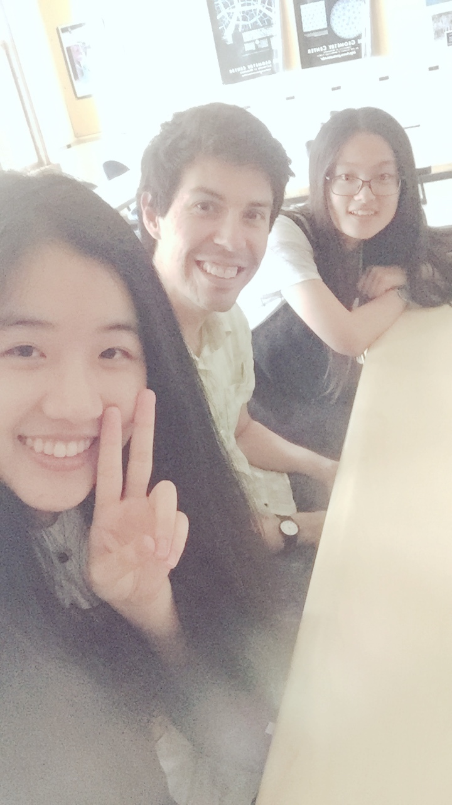
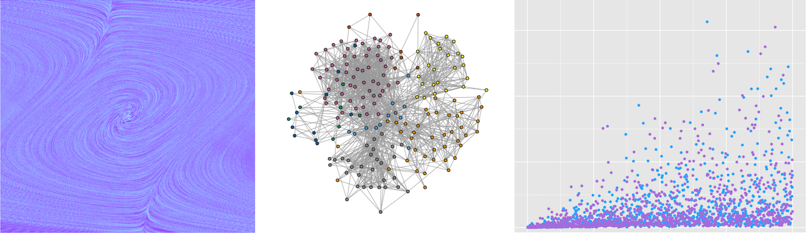
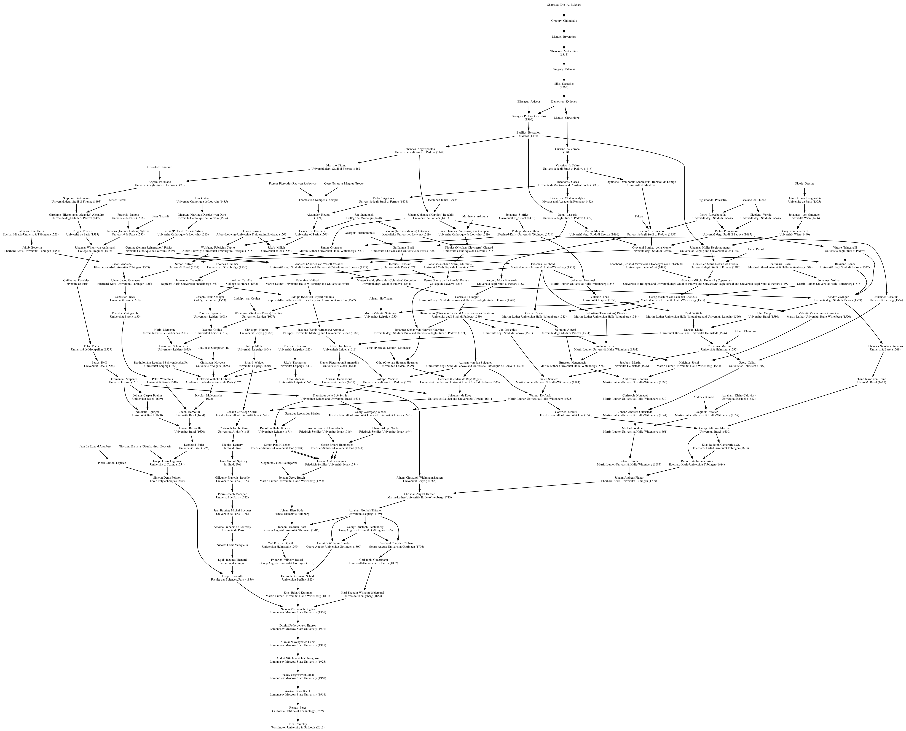

I am an Associate Professor of Mathematics at [Mount Holyoke College][MHC].  Previously, I was an NSF Alliance for Building Faculty Diversity Postdoctoral Fellow at [Iowa State University][ISU].  Before that, I got my PhD in mathematics at [Washington University in St. Louis][WU]. See my [cv][] for more details.

## Research

I'm interested in probability theory, stochastic processes, and their applications.  In the past few years I've worked on problems that overlap with billiard dynamical systems, differential geometry, and statistical physics.    

#### Students

<!--  -->

-	In Fall 2021, I worked with Emily Rosaci and Yuxuan (Susan) Wang, continuing their work from Summer 2021. 
	They created an interactive [Shiny app on random billiards][].
-	In Summer 2021, I worked with Ruozhen Gong, Emily Rosaci, and Yuxuan (Susan) Wang on a 
	project involving billiards, probability, and their interplay.
	Our main objects of study were polygonal billiard tables and some related Markov chains. 
	Their work was written up in a [report][ESR].
-	In Spring 2021, I worked with Ruozhen Gong on the relationship between
random billiard models and thermodynamics. Her work is documented in this
[summary report][Ruozhen Gong].
-	In Spring 2019, I worked with Nicole Andrews on Hidden Markov models related to random billiards. Her work is documented in this [write-up][Nicole Andrews].
-	In Fall 2018, I worked with Ziyan (Jessica) Feng on random polygonal billiards. Some of her work is documented on this [web page][Jessica Feng web].
-	In Summer 2017, I worked with Qiran (Karen) Dong and Fanyi (Young) Yang (Mount Holyoke), on a project studying random billiard systems with non-holonomic (rolling) constraints.  Here is their [talk][Karen Young talk]. 
-	In 2016, I worked with Tianle (Jeff) Yang (Iowa State) on a project studying the Lorentz gas model with random scatterer collisions.

#### Papers

<#include bib-include.html>  

## Teaching

{width=700px class="img-responsive center-block"} \

#### Current courses

- Math 102: Calculus II (Fall 2022)
- Math 203: Calculus III (Fall 2022)

#### Past courses

- Math 101: Calculus I (Spring 2019)
<!-- 
- [Math 102][]: Calculus II (Fall 2016, 2021)
 -->
- Math 211: Linear Algebra (Spring 2017)
- Math 232: Discrete Math (Fall 2018)
- [Math 241][]: Dynamical Systems (Spring 2022)
- [Math 301][]: Real Analysis (Fall 2020, 2021)
- Math 333: Differential Equations (Spring 2018)
- [Math 339SP/Stat 344][]: Stochastic Processes (Spring 2017, 2018, 2019, 2022)
- Math 342: Probability (Fall 2016, 2017, 2018; Spring 2021)
- Stat 395: Independent study, Statistical Analysis of Networks (Fall 2017)

Prior to coming to Mount Holyoke I taught:

- Introduction to Statistics (Summer 2009, Summer 2010 at Washington University)
- Calculus I (Summer 2008 at WUSTL)
- Calculus II (Fall 2013, Fall 2015 at Iowa State University)
- Linear Algebra (Summer 2012 at WUSTL, Spring 2014 at ISU)
- Real Analysis (Fall 2014 at ISU)  

## Miscellaneous 

[{width=300px class="img-responsive center-block"}](assets/img/chumley.png) \

-	I was interviewed by the [AMS Mathematical Moments][] program about my research
	on billiards and thermodynamics.
-	I am honored to have appeared in the [Lathisms 2020 calendar][]. I was also featured in an [MAA Focus article](http://digitaleditions.walsworthprintgroup.com/publication/?m=7656&i=677122&p=46) 
	about Lathisms.
-	The image above is a visualization of my [Math genealogy][].
-	Information on [summer research programs][] for math/stat students.
-	Mount Holyoke math/stat student [summer activities][].
-	An [MCMC demonstration](https://tchumley.shinyapps.io/cryptography/) for crytography that I made for talk.
-	Some notes that I've written for myself on [getting started with swarm2][], the high performance computing cluster at UMass.
-	I've made a page listing [Five College equivalent math/stat courses][].

## Contact

**Email**: tchumley   
**Office**: 423 Clapp Laboratory   
**Telephone**: 413-538-2525   
**Mailing address**:   
&nbsp;&nbsp;&nbsp;&nbsp;	Department of Mathematics and Statistics   
&nbsp;&nbsp;&nbsp;&nbsp;	Mount Holyoke College   
&nbsp;&nbsp;&nbsp;&nbsp;	50 College St   
&nbsp;&nbsp;&nbsp;&nbsp;	South Hadley, MA 01075   

[MHC]: https://www.mtholyoke.edu/acad/math
[Alliance]: https://www.math.ncsu.edu/alliance/
[ISU]: https://math.iastate.edu
[WU]: https://math.wustl.edu
[cv]: cv.pdf
[Math 101]: m101/
[Math 102]: m102/
[Math 211]: m211/
[Math 232]: m232/
[Math 241]: m241/
[Math 301]: m301/
[Math 333]: m333/
[Math 339SP/Stat 344]: m339sp/
[Math 342]: m342/
[Stat 395]: s395/
[Math genealogy]: https://www.genealogy.math.ndsu.nodak.edu/id.php?id=200961
[summer research programs]: misc/programs
[summer activities]: misc/summer-activities
[Ruozhen Gong]: assets/pdf/Independent_Study_Report_RuozhenGong.pdf
[ESR]: /pdf/Summer_2021_research_report.pdf
[Nicole Andrews]: assets/pdf/Nicole_Random_Billiards.pdf
[Jessica Feng web]: https://sites.google.com/mtholyoke.edu/tim-jessica-18-fall/
[Karen Young talk]: assets/pdf/karen-young-talk.pdf
[getting started with swarm2]: /misc/swarm2/
[Lathisms 2020 calendar]: https://www.lathisms.org/calendar-2020/tim-chumley
[Five College equivalent math/stat courses]: misc/course-equivalents
[Shiny app on random billiards]: https://olypys-yuxuan-wang.shinyapps.io/Billiards_Probability_and_their_Interplay/
[AMS Mathematical Moments]: https://www.ams.org/publicoutreach/mathmoments/mm160-billiards

