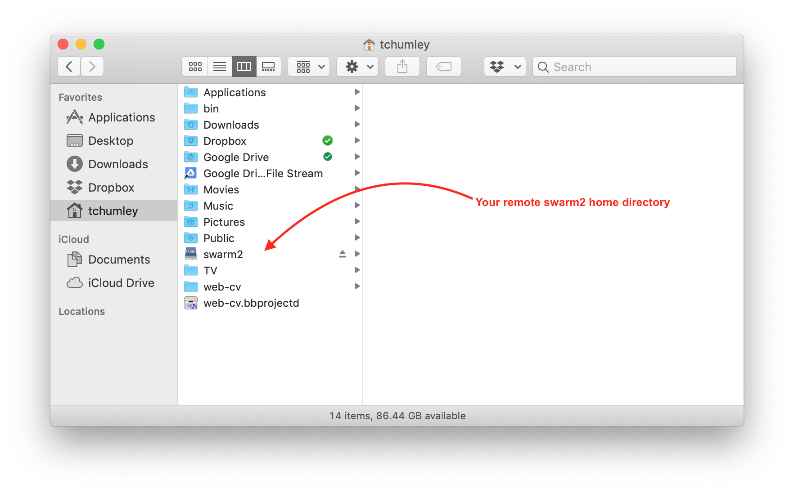

# Computing on the swarm2 cluster

This document outlines some basics of getting started with the swarm2 cluster. 

## Getting started with SLURM

In what follows, we'll discuss submitting jobs to the [swarm2 cluster](https://people.cs.umass.edu/~swarm/) using SLURM and the `sbatch` command, as well as how to do computation on the cluster using an interactive shell session through the `srun` command. The examples are intentionally minimal and only a starting point. More details on using SLURM can be found on the [UMass swarm2 user documentation](https://people.cs.umass.edu/~swarm/index.php?n=Main.NewSwarmDoc) and the [SLURM sbatch man page](https://slurm.schedmd.com/sbatch.html).

### sbatch

We give an example here on how to submit a job consisting of a python script. The only files needed are called [`test.py`](test.py) and [`run_python.slurm`](run_python.slurm), which you can download and store in a directory on the cluster. Running the following code from your shell on the cluster will download the files and store them in a directory called `test`

``` bash
mkdir -p test
cd test
wget https://www.mtholyoke.edu/~tchumley/misc/swarm2/test.py
wget https://www.mtholyoke.edu/~tchumley/misc/swarm2/run_python.slurm
```

We now discuss the contents of each file and then discuss how to use them.

#### Job code

The following code, which is the contents of `test.py`, is a simple python script for demonstration purposes. It will print out the name of the file and any arguments given when run through the python interpreter.

``` python
import sys
print ("the script has the name %s" % (sys.argv[0]))
if len(sys.argv) > 1:
	print ("the script has arguments %s" % (sys.argv[1:]))
```

You can try running the following on the cluster, to see some typical output.

``` bash
python test.py
python test.py hello world
```

#### Job submission code

The following code is the contents of `run_python.slurm`.

``` bash
#!/bin/bash
#SBATCH --nodes=1
#SBATCH --time=1:30:00
#SBATCH --out=python_job-%j.log

# load python interpreter
module load python/3.7.3 

# run the python script, given as command line argument
python $1
```

The code contains three parts:

-	Set up of some SLURM options:
	+	`#SBATCH --nodes=1` asks for one node on the cluster
	+	`#SBATCH --time=1:30:00` asks to reserve the node for 1.5 hours
	+	`#SBATCH --out=python_job-%j.log` asks to print any outputs of the job to a log file with the specified name format. The `%j` part of the file name will give the job number assigned by the scheduler.
	
-	Add necessary modules to your environment. Here we just add the module for python, version 3.7.3.

-	Run the desired commands for the job. Here `$1` corresponds to the first argument that will be fed into `run_python.slurm` when we submit our job.

#### Submitting the job

We are now ready to submit some jobs. Run the following commands to submit a couple jobs. Recall that you can see the results of the jobs in two files of the form `python_job-%j.log`.

``` bash
sbatch run_python.slurm test.py
sbatch run_python.slurm "test.py hello world"
```

### srun

For simple *one-liner* jobs, it's possible to use the `srun` command instead of going through the trouble of making a slurm file and using `sbatch`. Running the following will submit a job to a node on the cluster and display the results directly to your shell instead of writing a log file.

``` bash
srun test.py hello world
```

It's also possible to use options with srun, as in the following.

``` bash
srun --nodes=1 --time=1:30:00 test.py hello world
```

Note that `srun` can be also used to request an interactive shell on a node so that you can run commands manually one at a time.

``` bash
srun --pty /bin/bash
```

It will appear that nothing has changed, but your session will actually be running on one of the compute nodes. Try typing `hostname` to see that you're actually logged into one of the compute nodes. When you're done, you can type `exit` to return to the head node.

## Some remarks on parallel computing

There are some small differences in the options needed when running jobs that depend on the parallel computing paradigm used. The two examples below show the options that should be set for running a (shared memory) multithreaded job and for running a (non-shared-memory) multiprocess job. The options will be, respectively, `cpus-per-task` and `ntasks-per-node`.

### Multithreading

When running a job that consists of a single process (referred to as a `task` in the language of SLURM) that can spawn multiple threads, the SLURM `cpus-per-task` option should be set in order to request the use of multiple cores on the compute node. 

The example code below shows a script that generates some matrices and performs matrix multiplication. Python's `numpy` library takes advantage of multithreading by default and this is used when doing the multiplication. The code is contained in a file called [`multithreading_test.py`](multithreading_test.py).

``` python
import numpy as np
import time

start_time = time.time()

a = np.random.randn(5000, 50000)
b = np.random.randn(50000, 5000)
ran_time = time.time() - start_time
print("time to complete random matrix generation was %s seconds" % ran_time)

np.dot(a, b) # this line is multithreaded
print("time to complete dot was %s seconds" % (time.time() - start_time - ran_time))

```

Now try submitting the following jobs and notice the time savings incurred by requesting more cores through the `cpus-per-task` option. Note that the upper limit for the `cpus-per-task` option is the number of cores on the compute node being used.

``` bash
sbatch --cpus-per-task=5  run_python.slurm multithreading_test.py
sbatch --cpus-per-task=10 run_python.slurm multithreading_test.py
sbatch --cpus-per-task=20 run_python.slurm multithreading_test.py
```

### Multiprocessing

When running a job that consists of a process that can spawn multiple, memory independent processes, the SLURM `ntasks-per-node` option should be set in order to request the use of multiple cores on the compute node.

The example code below shows a script that performs a Monte Carlo simulation to estimate the value of pi. Each core will independently perform a fraction of the computations to be done by using Python's `multiprocessing` library and the `Pool` and `map` functionalities. The code is contained in a file called [`multiprocessing_test.py`](multiprocessing_test.py).

``` python
import random
import time
import os
from multiprocessing import Pool


# count the number of random points 
# that fall in the unit circle
# out of n points
def monte_carlo_steps(n):   
    count = 0
    for i in range(n):
        x = random.random()
        y = random.random()
                
        if x*x + y*y <= 1:
            count=count+1       
    
    return count


if __name__=='__main__':
    start_time = time.time()
    np = int(os.environ['SLURM_NTASKS_PER_NODE'])
    print("Number of cores allocated by slurm: ", np) 

    # Nummber of points to use for the pi estimation
    n = 10000000
    
    # each worker process gets floor(n/np) number of points to calculate pi from
    part_count = [n // np for i in range(np)]

    #Create the worker pool
    pool = Pool(processes = np)   

    # parallel map
    count = pool.map(monte_carlo_steps, part_count)

    print("Esitmated value of pi: ", sum(count)/(n*1.0)*4)
    print("Time to complete estimation was %s seconds" % (time.time() - start_time))
```

Try submitting the following jobs and notice the time savings incurred by requesting more cores through the `ntasks-per-node` option. Note that the upper limit for the `ntasks-per-node` option is the number of cores on the compute node being used.

``` bash
sbatch --ntasks-per-node=5  run_python.slurm multiprocessing_test.py
sbatch --ntasks-per-node=10 run_python.slurm multiprocessing_test.py
sbatch --ntasks-per-node=20 run_python.slurm multiprocessing_test.py
```

## Miscellaneous tips

### accessing storage directories

Your account on the cluster includes access to the `work1` and `scratch1` storage space. This can be important because your home directory is limited to 10GB of space, while `work1` has a 2TB quota and `scratch1` has no quota at all. Note that `work1` is backed up nightly but `scratch1` is never backed up. Your space is located in the following directories

-	`/mnt/nfs/work1`
-	`/mnt/nfs/scratch1`

However, it's possible to link to them from your home directory for easier access by running the following commands. Make sure `username` is replaced with your actual username.

``` bash
ln -s /mnt/nfs/work1/username ~/work1
ln -s /mnt/nfs/scratch1/username ~/scratch1

``` 

By the way, if you ever want to know how much space is being used by a given directory, you can run `du -sh`.

### ssh keys

It's possible to ssh into the cluster without having to type your password in each time. Instead, you can authenticate using an ssh key. Please be aware that the following directions assume that you're running macOS or Linux on your local computer.

The first line below generates a key, and the second line copies it onto the cluster. After running this, you won't be prompted for a password when logging in from the computer on which you generated the key. Make sure `username` is replaced with your actual username.

``` bash
ssh-keygen -t rsa
cat ~/.ssh/id_rsa.pub | ssh username@swarm2.cs.umass.edu 'cat >> ~/.ssh/authorized_keys'
```

### sshfs

[{width=350px class="img-responsive center-block"}](sshfs-screenshot.png)

It's possible to access your files on the cluster using sshfs. The following directions, specific to macOS, will make it look your home directory on the cluster is a mounted drive, like a USB stick for example.


1.	Begin by downloading and installing both `FUSE for macOS` and `SSHFS` from the [FUSE](https://osxfuse.github.io) website.

2.	Then, running the following will create, on your local computer's home directory, a folder called swarm2 onto which your cluster's home directory will be remotely mounted.

``` bash
mkdir -p ~/swarm2
sshfs swarm2.cs.umass.edu: ~/swarm2 -o reconnect -o volname=swarm2 -o IdentityFile=~/.ssh/id_rsa -o follow_symlinks
```

The cluster directory can be unmounted if necessary by running

``` bash
umount swarm2
```

3.	(Optional) The following commands will make a directory on your local home directory called `bin` and then save the commands above into a file called `mount-swarm2.sh`

``` bash
mkdir -p ~/bin
cat >> ~/bin/mount-swarm2.sh << EOF
#!/bin/bash
mkdir -p ~/swarm2
sshfs swarm2.cs.umass.edu: ~/swarm2 -o reconnect -o volname=swarm2 -o IdentityFile=~/.ssh/id_rsa -o follow_symlinks
EOF
chmod +x ~/mount-swarm2.sh
```

Now, whenever you want to mount your remote directory, you can run

``` bash
~/bin/mount-swarm2.sh
```

